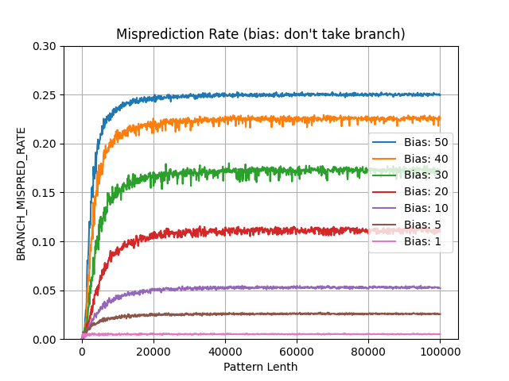
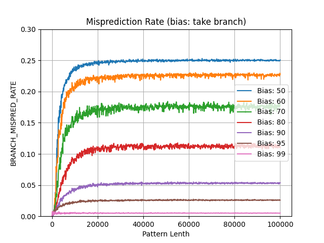

# Reverse Engineering my CPU's Branch-Predictor

In this investigation I aim to answer the following questions:

- What is the effective history size of my CPU's branch predictor?
- What can I learn about the branch predictor's strategy (e.g. does it default
  to always taking/not-taking the branch if it does not have enough information
  to make an educated decision)?

## General Approach and Hypothesis

To find the history size, I process random patterns of varying length.
As the pattern gets longer, it will be more difficult for the branch predictor
to recognise it as a repeating pattern, leading to more branch mispredictions.

The misprediction rate should converge when the pattern length exceeds the
effective history length of the branch predictor.

I also investigate how biasing the pattern towards taking or not-taking the
branch.
In theory, the more biased the pattern is towards take/not-take, the better the
branch predictor will perform (e.g. if it is completely biased towards take,
the predictor will quickly learn that is should always take the branch).

## Methods

### Workload

I use the `BRANCH` workload for this investigation.

I vary the `pattern-len` workload param while keeping the `n-branches` param
constant.
This results in the workload processing an array of length `n-branches`,
containing a repeating binary pattern of length `pattern-length` (e.g.
"10110100...").
For each element in the array, if the value is a 1 the branch will be taken,
and not taken if the value is 0.

I repeat the experiment multiple times for different bias values (using the
`bias` workload param.

### Metric Groups

I use the `BRANCH` metric group for this investigation, which calculates the
branch mispredition rate from the branch mispredictions and total branch
instructions.

### Final Cyclops Commands

```bash
# unbiased
./cyclops \
    -u 1 \
    -r 1 \
    -w BRANCH \
    -m BRANCH \
    -p bias=50 \
    -p n-branches=100000 \
    -s pattern-len=1:50000:100

# completely biased towards taking the branch
./cyclops \
    -u 1 \
    -r 1 \
    -w BRANCH \
    -m BRANCH \
    -p bias=100 \
    -p n-branches=100000 \
    -s pattern-len=1:50000:100

# completely biased towards not taking the branch
./cyclops \
    -u 1 \
    -r 1 \
    -w BRANCH \
    -m BRANCH \
    -p bias=0 \
    -p n-branches=100000 \
    -s pattern-len=1:50000:100
```

## Results




The figures above show clear branch misprediction rate curves.
The knees of the curves are roughly between pattern lengths of 5000 and 10000,
which is likely the effective history lenth for the branch predictor.
The curves are broad, which likely reflects the fact that modern CPUs don't
have a single branch history table, instead relying on multiple tables and
complex learning algorithms.

For the unbiased patterns (equally as likely to take as to not-take the
branch), the mispredition rate converges to 25%.
This is twice as good as a completely random guess, or always selecting
take/not-take, which would result in 50% mispredictions.
This suggests that the branch predictor is able to leverage some information
even when the pattern length exceeds the effective history size.

One of the most interesting results is that there is no difference between
biasing towards taking or not-taking the branch.

## Future Investigations

- How would different distributions of 1s and 0s affect mispredition rates
  (e.g. if they were grouped like "111001111000001...")?
- How will these results change for different CPUs?
